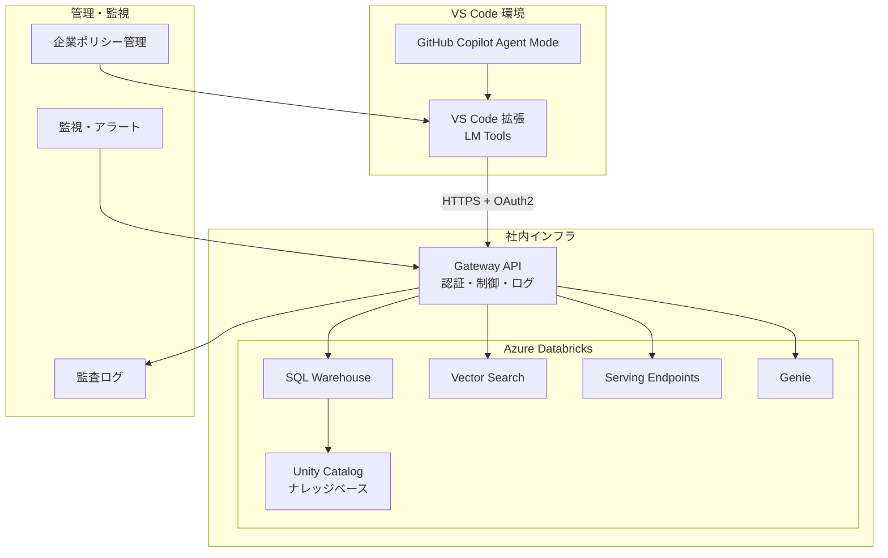
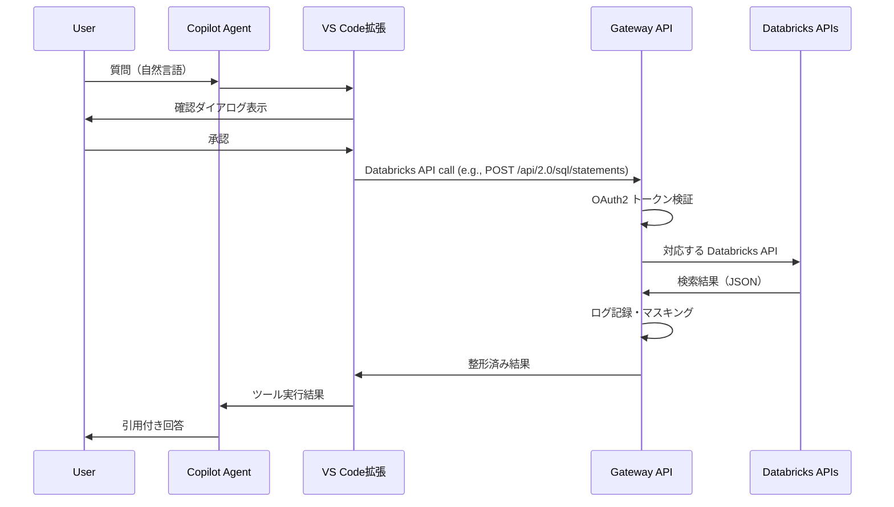
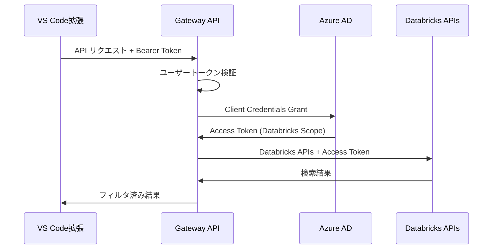

# VS Code Language Model Tool API を活用した Azure Databricks ナレッジベース連携システム 設計書

<br>

# 文書情報
---
* **文書名**: VS Code LM Tools × Azure Databricks ナレッジベース連携システム 設計書
* **作成日**: 2025年9月1日
* **更新日**: 2025年9月1日
* **バージョン**: 1.0
* **作成者**: システム開発チーム
* **関連文書**: 要件定義書 v1.0, LanguageModelToolAPIの使用検討

<br>

# 1. システム設計概要
---

## 1.1 設計方針
- **セキュリティファースト**: 検索専用アクセス、OAuth2認証、監査ログ完備
- **企業ガバナンス重視**: VS Code ポリシー対応、集中管理機能
- **開発効率最適化**: IDE内完結、自動ツール選択、引用付き回答
- **将来拡張性**: 段階的展開（LM Tools → Copilot Extensions → MCP）

## 1.2 アーキテクチャパターン
**3層アーキテクチャ + Gateway パターン**
- **プレゼンテーション層**: VS Code 拡張（LM Tools）
- **アプリケーション層**: Gateway API（認証・制御・ログ）
 - **データ層**: Azure Databricks（SQL Warehouse, Vector Search, Serving Endpoints, Genie, Unity Catalog）

<br>

# 2. システムアーキテクチャ
---

## 2.1 全体構成図



## 2.2 通信フロー

### 2.2.1 検索実行フロー


<br>

# 3. コンポーネント設計
---

## 3.1 VS Code 拡張（LM Tools）

### 3.1.1 拡張構成
```
databricks-knowledge-search/
├── package.json              # 拡張メタデータ・設定
├── src/
│   ├── extension.ts          # エントリーポイント
│   ├── tools/
│   │   └── dbxSearchTool.ts  # LM Tools 実装
│   ├── services/
│   │   ├── gatewayClient.ts  # Gateway API クライアント
│   │   └── authService.ts    # 認証管理
│   ├── config/
│   │   └── resources.json    # 利用可能なクエリID・インデックス名など
│   └── utils/
│       └── logger.ts         # ログ出力
└── README.md
```

### 3.1.2 拡張メタデータ設定

**基本情報**
- 拡張名: `databricks-knowledge-search`
- 表示名: "Databricks Knowledge Search"
- 説明: "Azure Databricks ナレッジベース検索ツール"
- バージョン: 1.0.0
- 対応VS Codeバージョン: 1.99以上

**Language Model Tool 定義**
| 項目           | 値                                           |
| -------------- | -------------------------------------------- |
| ツール名       | dbx_search                                   |
| 表示名         | Databricks Knowledge Search                  |
| 説明           | 社内ナレッジベース（Azure Databricks）を検索 |
| 参照名         | dbxSearch                                    |
| プロンプト参照 | 有効                                         |

**パラメータ仕様**
| パラメータ | 型      | 必須 | デフォルト値 | 最大値 | 説明         |
| ---------- | ------- | ---- | ------------ | ------ | ------------ |
| query      | string  | ○    | -            | -      | 検索クエリ   |
| top_k      | integer | -    | 5            | 20     | 取得件数上限 |

**設定項目**
| 設定キー   | デフォルト値                      | 説明                             |
| ---------- | --------------------------------- | -------------------------------- |
| gatewayUrl | https://api.company.com/knowledge | Gateway API のベースURL          |
| timeout    | 10000                             | リクエストタイムアウト（ミリ秒） |

### 3.1.3 LM Tools 実装概要

**DbxSearchTool クラス設計**

Language Model Tool インターフェースを実装し、以下の機能を提供：

**主要機能**
1. **リクエスト受け付け**: パラメータから検索クエリやリソースIDを抽出
2. **ユーザー確認**: 実行前の確認ダイアログ表示
3. **Databricks API 選択**: `resources.json` の定義に基づき利用する API とリソースを決定
4. **Gateway API 呼び出し**: GatewayClient サービスを通じて選択した Databricks API を実行
5. **結果整形**: 検索結果や推論結果を引用可能な形式に整形
6. **エラーハンドリング**: 例外発生時の適切なエラーメッセージ表示

**処理フロー**
1. パラメータ validation（query必須、top_k範囲チェックなど）
2. ユーザー確認ダイアログ表示
3. リソース定義の読み込み
4. Gateway API クライアント初期化
5. 対応する Databricks API 呼び出し（timeout: 10秒）
6. 結果のMarkdown形式整形
7. Logger による実行ログ記録
8. LanguageModelToolResult として結果返却

**エラー処理戦略**
- Network Error: 接続エラーメッセージ表示
- Timeout Error: タイムアウト通知と再試行提案
- Authentication Error: 認証設定の確認依頼
- API Error: 詳細なエラー情報のログ出力（ユーザーには簡略化メッセージ）

**依存サービス**
- GatewayClient: HTTP通信とレスポンス処理
- Logger: 実行ログとエラーログの記録
- VS Code API: ダイアログ表示とツール結果返却

## 3.2 Gateway API

Python（FastAPI）で実装される Databricks API プロキシサービス。

### 3.2.1 API構成概要

**ディレクトリ構造**

Gateway API は以下のモジュール構成で設計されています：

| モジュール             | 役割                 | 主要ファイル                            |
| ---------------------- | -------------------- | --------------------------------------- |
| **エントリーポイント** | アプリケーション起動 | app/main.py                             |
| **ルーティング**       | Databricks API毎のルート定義 | app/routers/sql_statements.py,<br>app/routers/queries.py,<br>app/routers/vector_search.py,<br>app/routers/serving_endpoints.py,<br>app/routers/genie.py |
| **サービス層**         | Databricks API クライアント | app/services/ (複数ファイル) |
| **ミドルウェア**       | 横断的関心事         | app/middleware/ (3ファイル) |
| **ユーティリティ**     | 共通機能             | app/utils/logger.py      |
| **設定**               | 環境別設定           | config/settings.yaml     |

**主要サービス**
1. **statementClient**: Databricks SQL Statement Execution API との通信
2. **queriesClient**: Databricks SQL Queries API との通信
3. **vectorSearchClient**: Vector Search Indexes API との通信（Endpoints API はインデックスをホストする計算リソース管理用）
4. **servingClient**: Real-Time Serving Endpoints API との通信
5. **genieClient**: Genie API との通信
6. **authService**: OAuth2 認証とトークン管理
7. **cacheService**: Redis を使用したレスポンスキャッシュ
8. **auditService**: 監査ログの記録と管理

**ミドルウェア機能**
1. **auth**: JWT トークン検証と認可チェック
2. **rateLimiter**: ユーザー別レート制限の適用
3. **piiMasking**: 個人情報の自動マスキング処理

### 3.2.2 プロキシエンドポイント設計

Gateway API は Databricks API と 1 対 1 のエンドポイントを提供し、リクエストをそのまま転送する。主にサポートするエンドポイントは以下の通り:

| メソッド | パス | 対応する Databricks API |
| -------- | ---- | ---------------------- |
| POST | /api/2.0/sql/statements | SQL Statement Execution |
| POST | /api/2.0/sql/queries/{query_id}/execute | SQL Queries |
| POST | /api/2.0/vector-search/indexes/{index_name}/query | Vector Search |
| POST | /api/2.0/serving-endpoints/{endpoint_name}/invocations | Real-Time Serving |
| POST | /api/2.0/genie/spaces/{space_id}/start-conversation | Genie |

**処理フロー**
1. **リクエスト受信**: LM Tools からのリクエストとパスを検証
2. **認証確認**: Bearerトークンの検証とユーザー情報取得
3. **Databricks呼び出し**: 対応する Databricks API へリクエストを転送
4. **PII マスキング**: 必要に応じてレスポンスの個人情報をマスキング
5. **結果キャッシュ**: 5分間のTTLでRedisに結果保存
7. **監査ログ記録**: 実行ログの記録（ハッシュ化されたクエリ、実行時間等）
8. **レスポンス返却**: 整形済み検索結果の返却

**エラーハンドリング**
- 認証エラー（401）: 無効なトークンまたは期限切れ
- レート制限エラー（429）: ユーザー別制限超過時
- バリデーションエラー（400）: 不正なパラメータ
- 内部エラー（500）: Databricks接続エラーまたはシステム障害
### 3.2.3 Databricks API クライアント設計

Gateway API は Databricks API をそのままプロキシするクライアントを実装する。

**クライアント一覧**
- StatementExecutionClient: `POST /api/2.0/sql/statements` ほか
- QueriesClient: `POST /api/2.0/sql/queries/{query_id}/execute`
- VectorSearchClient: `POST /api/2.0/vector-search/indexes/{index_name}/query`
- ServingClient: `POST /api/2.0/serving-endpoints/{endpoint_name}/invocations`
- GenieClient: `POST /api/2.0/genie/spaces/{space_id}/start-conversation`

#### 共通処理
1. AuthService で OAuth2 トークンを取得する。
2. LM Tools 定義の許可リソースかを検証する。
3. Databricks API と同一のパス・メソッドでリクエストを転送する。
4. Databricks API のレスポンスを変更せずに返却する。

#### StatementExecutionClient
- 対応エンドポイント:
  - `POST /api/2.0/sql/statements`
  - `GET /api/2.0/sql/statements/{statement_id}`
  - `GET /api/2.0/sql/statements/{statement_id}/result/chunks/{chunk_index}`
  - `POST /api/2.0/sql/statements/{statement_id}/cancel`
- ハイブリッドモードや EXTERNAL_LINKS などのパラメーターは LM Tools が指定する。

#### QueriesClient
- 対応エンドポイント: `POST /api/2.0/sql/queries/{query_id}/execute`

#### VectorSearchClient
- 対応エンドポイント: `POST /api/2.0/vector-search/indexes/{index_name}/query`
- `query_text` や `query_vector` の生成は Gateway API では行わない。

#### ServingClient
- 対応エンドポイント: `POST /api/2.0/serving-endpoints/{endpoint_name}/invocations`

#### GenieClient
- 対応エンドポイント: `POST /api/2.0/genie/spaces/{space_id}/start-conversation`

## 3.3 認証サービス設計

### 3.3.1 OAuth2 実装概要

**認証フロー**

Azure Databricks OAuth2 Client Credentials Grant を使用したサービス間認証を実装します。

**トークン管理戦略**
| 要素                   | 設計内容                                 |
| ---------------------- | ---------------------------------------- |
| **キャッシュ方式**     | メモリベースのトークンキャッシュ         |
| **有効期限管理**       | 期限切れ1分前の自動リフレッシュ          |
| **スコープ**           | `sql` スコープのみ（最小権限原則）       |
| **エラーハンドリング** | トークン取得失敗時の指数バックオフ再試行 |

**認証プロセス**
1. **キャッシュ確認**: 有効なアクセストークンがメモリキャッシュに存在するか確認
2. **期限チェック**: トークンの有効期限を確認し、1分前にリフレッシュを実行
3. **トークン取得**: Databricks OIDC エンドポイントに Client Credentials Grant リクエスト
4. **レスポンス処理**: アクセストークンと有効期限の抽出・保存
5. **キャッシュ更新**: メモリキャッシュに新しいトークン情報を保存

**TokenInfo データ構造**
| フィールド  | 型     | 説明                                    |
| ----------- | ------ | --------------------------------------- |
| accessToken | string | OAuth2 アクセストークン                 |
| expiresAt   | number | トークン有効期限（Unix タイムスタンプ） |

**セキュリティ考慮事項**
- クライアント認証情報は環境変数から取得
- トークンはメモリ内でのみ保持（永続化なし）
- HTTPS通信の強制
- 認証失敗時の詳細情報漏洩防止

<br>

# 4. データベース設計
---

## 4.1 Databricks ナレッジベース構成

### 4.1.1 検索ビュー定義

**Unity Catalog ビュー設計**

ナレッジベース検索用のビュー `main.knowledge.kb_docs` の構造と要件：

**ビューの目的**
- 公開可能な文書のみを対象とした検索可能なビューの提供
- 秘匿情報を含む文書の自動除外
- 全文検索用の最適化されたテキストインデックス

**データ変換ロジック**
| 元テーブル列 | ビュー列        | 変換内容                           |
| ------------ | --------------- | ---------------------------------- |
| doc_id       | id              | 文書の一意識別子                   |
| title        | title           | 文書タイトル（そのまま）           |
| summary      | snippet         | 文書要約（検索結果表示用）         |
| source_url   | source_url      | 元文書へのリンク                   |
| full_text    | text            | 全文テキスト（検索対象）           |
| -            | searchable_text | title + summary + full_text の結合 |

**フィルタリング条件**
- ステータスが 'published' の文書のみ
- is_public フラグが true の文書のみ  
- カテゴリが 'confidential', 'personal' でない文書のみ

**ソート順序**
- updated_at 降順（最新の文書が優先）

### 4.1.2 検索クエリ設計

**基本検索クエリ仕様**

全文検索機能を使用した基本的な検索クエリの設計：

**検索対象とパラメータ**
| 要素             | 内容                                                  |
| ---------------- | ----------------------------------------------------- |
| **検索対象列**   | searchable_text（title + summary + full_text の結合） |
| **使用関数**     | MATCH() - Databricks の全文検索関数                   |
| **スコアリング** | MATCH_SCORE() - 関連度スコアの算出                    |
| **ソート**       | relevance_score 降順（最も関連度の高い文書が上位）    |
| **制限**         | LIMIT句でtop_kパラメータに基づく件数制限              |

**クエリパラメータ**
| パラメータ | 型      | 説明           | 例                  |
| ---------- | ------- | -------------- | ------------------- |
| :query     | string  | 検索キーワード | "API 設計 パターン" |
| :row_limit | integer | 取得行数制限   | 5                   |

**拡張検索（カテゴリフィルタ付き）**

カテゴリによるフィルタリング機能を持つ検索クエリ：

**追加パラメータ**
| パラメータ | 型                | 説明             | 例               |
| ---------- | ----------------- | ---------------- | ---------------- |
| :category  | string (nullable) | カテゴリフィルタ | "technical_docs" |

**フィルタ条件**
- NULL の場合: 全カテゴリを対象
- 値指定の場合: 指定カテゴリのみを対象

**検索結果カラム**
| カラム          | 型      | 説明         |
| --------------- | ------- | ------------ |
| id              | string  | 文書ID       |
| title           | string  | 文書タイトル |
| snippet         | string  | 抜粋テキスト |
| source_url      | string  | 元文書URL    |
| category        | string  | 文書カテゴリ |
| relevance_score | decimal | 関連度スコア |

## 4.2 権限設計

### 4.2.1 Unity Catalog 権限設定

**サービスプリンシパル権限管理**

Azure Databricks Unity Catalog における最小権限の原則に基づく権限設計：

**権限付与対象**
- サービスプリンシパル: `sp-knowledge-search`

**カタログレベル権限**
| リソース     | 権限        | 用途                     |
| ------------ | ----------- | ------------------------ |
| CATALOG main | USE CATALOG | カタログへのアクセス許可 |

**スキーマレベル権限**
| リソース              | 権限       | 用途                             |
| --------------------- | ---------- | -------------------------------- |
| SCHEMA main.knowledge | USE SCHEMA | ナレッジスキーマへのアクセス許可 |

**テーブル・ビューレベル権限**
| リソース                    | 権限   | 用途                                 |
| --------------------------- | ------ | ------------------------------------ |
| VIEW main.knowledge.kb_docs | SELECT | 検索ビューからの読み取り専用アクセス |

**SQL Warehouse 権限**
| リソース                             | 権限    | 用途                                |
| ------------------------------------ | ------- | ----------------------------------- |
| WAREHOUSE knowledge_search_warehouse | CAN_USE | SQL実行のためのウェアハウス使用権限 |

**権限の特徴**
- **読み取り専用**: SELECT権限のみでデータ変更不可
- **最小スコープ**: 必要最小限のリソースへのアクセスのみ
- **監査可能**: 全てのアクセスがUnity Catalogで記録

<br>

# 5. セキュリティ設計
---

## 5.1 認証・認可アーキテクチャ

### 5.1.1 多層認証モデル

**認証階層の設計**

システム全体で4層の認証・認可制御を実装：

| 層        | 認証方式                  | 対象           | 検証内容                  |
| --------- | ------------------------- | -------------- | ------------------------- |
| **1層目** | VS Code Account           | エンドユーザー | VS Codeアカウントの有効性 |
| **2層目** | Bearer Token              | Gateway API    | JWTトークンの署名検証     |
| **3層目** | OAuth2 Client Credentials | Databricks API | サービスプリンシパル認証  |
| **4層目** | Unity Catalog RBAC        | ナレッジベース | リソースアクセス権限      |

**認証フロー概要**

1. **ユーザー認証**: VS Code拡張がユーザーのサインイン状態を確認
2. **API認証**: Gateway APIがBearerトークンを検証
3. **サービス認証**: Gateway APIがDatabricksに対してサービス認証を実行
4. **リソース認証**: Databricksが Unity Catalog の権限設定に基づいてアクセス制御

### 5.1.2 OAuth2 フロー詳細


## 5.2 セキュリティ制御

### 5.2.1 PII マスキング設計

**個人情報保護機能**

検索結果に含まれる可能性のある個人情報を自動検出・マスキングする機能の設計：

**マスキング対象パターン**
| 情報種別                 | パターン            | マスキング形式 | 例                                |
| ------------------------ | ------------------- | -------------- | --------------------------------- |
| **クレジットカード番号** | ####-####-####-#### | [CARD-****]    | 1234-5678-9012-3456 → [CARD-****] |
| **メールアドレス**       | xxx@yyy.zzz         | [EMAIL]        | test@example.com → [EMAIL]        |
| **電話番号**             | ###-####-####       | [PHONE]        | 03-1234-5678 → [PHONE]            |
| **社会保障番号**         | ###-##-####         | [SSN]          | 123-45-6789 → [SSN]               |

**PiiMasking クラス機能**

**maskText メソッド**
- 入力テキストに対して全パターンのマスキング処理を実行
- 正規表現による高速なパターンマッチング
- 元テキストの構造を保持しつつ機密情報のみ置換

**hashSensitive メソッド**
- 検索クエリ等の機密性のあるテキストをSHA256でハッシュ化
- ログ記録時の個人情報保護
- ハッシュ値は16文字に短縮（ストレージ効率とセキュリティのバランス）

**セキュリティ考慮事項**
- マスキングパターンの定期的な見直しと追加
- 偽陽性（正常なテキストの誤マスキング）の最小化
- マスキング処理のパフォーマンス影響の監視

### 5.2.2 レート制御設計

**リクエスト制御機能**

システムの安定性とリソース保護のためのレート制限機能：

**制限パラメータ**
| 項目                 | 設定値                   | 説明                             |
| -------------------- | ------------------------ | -------------------------------- |
| **時間窓**           | 1分間                    | レート制限の評価時間単位         |
| **最大リクエスト数** | 30回/分                  | ユーザーあたりの許可リクエスト数 |
| **識別キー**         | ユーザーID or IPアドレス | レート制限の適用単位             |

**制御ロジック**
1. **キー生成**: 認証済みユーザーはユーザーID、未認証はIPアドレスを使用
2. **カウンタ管理**: Redis等でリクエスト数をカウント
3. **制限チェック**: 時間窓内のリクエスト数が上限を超過しているか確認
4. **レスポンス制御**: 制限超過時は429ステータスコードを返却

**エラーレスポンス**
制限超過時の標準化されたエラーレスポンス：

| 項目                 | 値                                                                   |
| -------------------- | -------------------------------------------------------------------- |
| **HTTPステータス**   | 429 Too Many Requests                                                |
| **エラーコード**     | "Rate limit exceeded"                                                |
| **メッセージ**       | "リクエスト制限に達しました。しばらく待ってから再試行してください。" |
| **標準ヘッダー**     | Rate-Limitヘッダーの付与                                             |
| **レガシーヘッダー** | 無効化（セキュリティ向上）                                           |

**セキュリティ機能**
- DDoS攻撃の軽減
- リソース枯渇攻撃の防止
- 正常ユーザーへの影響最小化
- 攻撃パターンの早期検出

<br>

# 6. 運用設計
---

## 6.1 監視・ログ設計

### 6.1.1 ログ構造設計

**監査ログ仕様**

セキュリティ要件とコンプライアンス要求を満たす監査ログの設計：

**AuditLog インターフェース**
| フィールド    | 型      | 必須 | 説明                        | 例                         |
| ------------- | ------- | ---- | --------------------------- | -------------------------- |
| timestamp     | string  | ○    | ISO8601形式のタイムスタンプ | "2025-09-01T10:30:00.123Z" |
| userId        | string  | ○    | ハッシュ化されたユーザーID  | "a1b2c3d4e5f6..."          |
| action        | string  | ○    | 実行されたアクション        | "search", "search_error"   |
| queryHash     | string  | -    | ハッシュ化された検索クエリ  | "7f8e9d0a1b2c..."          |
| resultCount   | number  | -    | 返却された結果数            | 5                          |
| executionTime | number  | ○    | 処理時間（ミリ秒）          | 1245                       |
| ipAddress     | string  | ○    | 送信元IPアドレス            | "192.168.1.100"            |
| userAgent     | string  | -    | ユーザーエージェント        | "VSCode/1.99.0"            |
| fromCache     | boolean | -    | キャッシュヒットの有無      | true                       |
| error         | string  | -    | エラー内容（エラー時のみ）  | "Connection timeout"       |

**アクション種別**
| アクション   | 説明         | 記録タイミング     |
| ------------ | ------------ | ------------------ |
| search       | 正常検索実行 | 検索完了時         |
| search_error | 検索エラー   | エラー発生時       |
| auth_success | 認証成功     | トークン検証成功時 |
| auth_failure | 認証失敗     | トークン検証失敗時 |

**プライバシー保護**
- ユーザーIDは一方向ハッシュ化
- 検索クエリは機密情報をマスキング後ハッシュ化
- IPアドレスは内部監査用に保持（外部提供時は匿名化）

### 6.1.2 メトリクス収集設計

**パフォーマンスメトリクス仕様**

運用監視とシステム最適化のためのメトリクス収集機能：

**MetricsCollector 機能概要**

システムの健全性とパフォーマンスを定量的に監視するためのメトリクス収集サービス。

**収集メトリクス**
| メトリクス名                  | 型        | 説明                         | 単位   |
| ----------------------------- | --------- | ---------------------------- | ------ |
| search_requests_total         | Counter   | 総検索リクエスト数           | 回数   |
| search_duration_seconds       | Histogram | 検索処理時間分布             | 秒     |
| search_errors_total           | Counter   | 検索エラー数                 | 回数   |
| cache_hits_total              | Counter   | キャッシュヒット数           | 回数   |
| databricks_connections_active | Gauge     | アクティブなDatabricks接続数 | 接続数 |

**メトリクスラベル**
- **success**: 成功/失敗の区分 ("true"/"false")
- **error_type**: エラー種別（timeout, auth_error等）
- **cache_status**: キャッシュ状態（hit/miss）

**recordSearch メソッド機能**
検索実行時の各種メトリクスを一括記録：
1. リクエスト数カウンタの増加（成功/失敗ラベル付き）
2. 実行時間のヒストグラム記録（秒単位変換）
3. キャッシュヒット時の専用カウンタ増加
4. エラー時のエラーカウンタ増加

**活用目的**
- **パフォーマンス監視**: レスポンス時間の傾向分析
- **容量計画**: リクエスト数の予測とリソース計画
- **障害検知**: エラー率の異常検知
- **最適化効果測定**: キャッシュヒット率の改善追跡

## 6.2 アラート設定

### 6.2.1 監視項目・閾値設計

**アラート設定仕様**

システムの異常を早期検知し、適切なレベルで通知するアラート機能の設計：

**アラートレベル定義**
| レベル       | 説明           | 通知先     | 対応要求         |
| ------------ | -------------- | ---------- | ---------------- |
| **info**     | 情報提供レベル | 開発チーム | 任意（改善検討） |
| **warning**  | 注意レベル     | 運用チーム | 監視強化         |
| **critical** | 緊急レベル     | 全関係者   | 即座対応必要     |

**監視項目別設定**

**高レスポンス時間アラート**
- **条件**: 平均検索処理時間が5秒超過
- **評価期間**: 直近の実行結果
- **重要度**: warning
- **影響**: ユーザーエクスペリエンスの低下

**エラー率高アラート**  
- **条件**: 5分間のエラー率が5%超過
- **計算式**: rate(search_errors_total[5m])
- **重要度**: critical
- **影響**: サービス可用性の低下

**Databricks接続障害アラート**
- **条件**: Databricksサービスへの接続不可
- **監視対象**: up{job="databricks"} メトリクス
- **重要度**: critical
- **影響**: 検索機能の完全停止

**キャッシュヒット率低下アラート**
- **条件**: 10分間のキャッシュヒット率が30%未満
- **計算式**: キャッシュヒット数/総検索数
- **重要度**: info
- **影響**: パフォーマンスとコスト効率の低下

**アラート通知フロー**
1. メトリクス収集システムでの閾値監視
2. 条件満足時のアラート発火
3. 重要度に応じた通知先選択
4. 通知内容の自動生成（メトリクス値、推奨アクション等）
5. エスカレーション設定（未対応時の上位通知）

<br>

# 7. 配備・デプロイ設計
---

## 7.1 VS Code 拡張配布

### 7.1.1 VSIX パッケージング戦略

**VS Code 拡張の配布方式**

企業環境での安全な拡張配布を実現するためのパッケージング戦略：

**パッケージ作成プロセス**
1. **開発環境での検証**: 機能テストとセキュリティスキャン
2. **VSCE ツール使用**: Visual Studio Code Extension Manager による標準パッケージング
3. **署名付きパッケージ作成**: 企業証明書による電子署名付与
4. **配布用パッケージ準備**: 内部配布用の VSIX ファイル生成

**パッケージング手順**
| ステップ | 作業内容          | 使用ツール          |
| -------- | ----------------- | ------------------- |
| 1        | 依存関係の最新化  | npm update          |
| 2        | テスト実行        | npm test            |
| 3        | VSIX ファイル生成 | vsce package        |
| 4        | デジタル署名付与  | vsce package --sign |

**署名付きパッケージの利点**
- **信頼性確保**: 企業発行の証明書による真正性保証
- **改ざん防止**: パッケージの完全性検証
- **ポリシー準拠**: 企業セキュリティポリシーへの対応

### 7.1.2 企業内配布戦略

**配布方式とガバナンス**

組織のセキュリティポリシーと管理要件に適合した拡張配布戦略：

**配布方式**
| 方式                     | 対象範囲   | 承認プロセス     | 用途               |
| ------------------------ | ---------- | ---------------- | ------------------ |
| **Internal Marketplace** | 組織全体   | 必須承認         | 全社展開時         |
| **VSIX Direct Install**  | 開発チーム | マネージャー承認 | パイロット・開発用 |

**組織ポリシー設定**
拡張の使用を制御するための VS Code ポリシー設定：

| ポリシーキー                | 設定値                                  | 効果                                |
| --------------------------- | --------------------------------------- | ----------------------------------- |
| extensions.allowed          | ["company.databricks-knowledge-search"] | 許可拡張の明示的指定                |
| chat.agent.enabled          | true                                    | GitHub Copilot Agent モードの有効化 |
| chat.extensionTools.enabled | true                                    | 拡張ツールの LM Tools 使用許可      |

**承認ワークフロー**
1. **開発チーム申請**: 拡張インストール申請の提出
2. **セキュリティレビュー**: 拡張のセキュリティ評価
3. **マネージャー承認**: 業務必要性の確認
4. **IT部門配布**: 承認後の配布実行

**管理機能**
- **使用状況監視**: 拡張の利用状況追跡
- **アップデート管理**: セキュリティアップデートの強制適用
- **利用制限**: 特定ユーザー・グループへのアクセス制御

## 7.2 Gateway API デプロイ

### 7.2.1 コンテナ構成設計

**Docker コンテナ仕様**

Gateway API のコンテナ化による一貫したデプロイメント環境の実現：

**ベースイメージ選定**
- **イメージ**: python:3.11-slim
- **選定理由**: 軽量性、セキュリティ、Python 3.11 サポート

**コンテナ構成要素**
| 要素                         | 設定                                      | 目的                           |
| ---------------------------- | ----------------------------------------- | ------------------------------ |
| **作業ディレクトリ**         | /app                                     | アプリケーション配置先         |
| **依存関係インストール**     | pip install --no-cache-dir -r requirements.txt | 本番環境用パッケージのみ       |
| **アプリケーションファイル** | app/, config/                            | ソースコード・設定ファイル     |
| **実行ユーザー**             | appuser (UID:1001)                       | セキュリティ強化（非root実行） |
| **公開ポート**               | 8000                                     | HTTP API サーバーポート        |
| **起動コマンド**             | uvicorn app.main:app --host 0.0.0.0 --port 8000 | アプリケーション実行           |

**セキュリティ強化策**
1. **非root実行**: 専用ユーザー（appuser）での実行
2. **最小権限**: 必要最小限のファイルアクセス権限
3. **Slim イメージ**: 軽量で脆弱性の少ないベースOS
4. **本番依存関係**: 開発用パッケージの除外

**ビルド最適化**
- **レイヤーキャッシュ**: requirements.txt を先にコピーして依存関係キャッシュを活用
- **不要ファイル除外**: .dockerignore による不要ファイルの除外
- **マルチステージビルド**: 必要に応じてビルドステージの分離

### 7.2.2 Kubernetes デプロイ設計

**Kubernetes マニフェスト仕様**

高可用性とスケーラビリティを確保するKubernetes環境でのデプロイ設計：

**Deployment 設定**
| 項目                 | 設定値                            | 説明                     |
| -------------------- | --------------------------------- | ------------------------ |
| **レプリカ数**       | 3                                 | 高可用性のための冗長化   |
| **アプリラベル**     | databricks-gateway                | サービス識別用           |
| **コンテナイメージ** | company/databricks-gateway:latest | 企業レジストリのイメージ |
| **公開ポート**       | 8000                              | HTTP API サーバーポート  |

**環境変数設定**
| 環境変数                 | 取得元                    | 説明                            |
| ------------------------ | ------------------------- | ------------------------------- |
| DATABRICKS_WORKSPACE_URL | Secret: databricks-config | Databricks ワークスペース URL   |
| DATABRICKS_CLIENT_ID     | Secret: databricks-config | OAuth2 クライアント ID          |
| DATABRICKS_CLIENT_SECRET | Secret: databricks-config | OAuth2 クライアントシークレット |

**リソース制限**
| リソース   | Requests | Limits | 目的                     |
| ---------- | -------- | ------ | ------------------------ |
| **メモリ** | 256Mi    | 512Mi  | 安定した動作とメモリ制御 |
| **CPU**    | 250m     | 500m   | 適切な処理性能確保       |

**ヘルスチェック設定**
| 項目               | 設定                    | 説明                     |
| ------------------ | ----------------------- | ------------------------ |
| **Liveness Probe** | GET /health (Port 8000) | コンテナの生存確認       |
| **初期遅延**       | 30秒                    | アプリケーション起動待ち |
| **チェック間隔**   | 10秒                    | 定期的な生存確認         |

**セキュリティ考慮事項**
- **Secret 管理**: 機密情報の Kubernetes Secret での管理
- **最小権限**: 不要な権限の付与回避
- **ネットワーク分離**: Pod間通信の適切な制御
- **イメージ検証**: 署名付きイメージの使用推奨

<br>

# 8. パフォーマンス設計
---

## 8.1 キャッシュ戦略

### 8.1.1 多層キャッシュ設計

**CacheService アーキテクチャ**

パフォーマンス最適化のための階層化キャッシュシステム：

**キャッシュ階層**
| レベル           | 技術         | 特徴           | TTL | 用途                   |
| ---------------- | ------------ | -------------- | --- | ---------------------- |
| **L1キャッシュ** | メモリ (Map) | 超高速アクセス | 1分 | 頻繁アクセスデータ     |
| **L2キャッシュ** | Redis        | 共有可能       | 5分 | 複数インスタンス間共有 |

**CacheService 主要機能**

**get メソッドの動作フロー**
1. **L1確認**: メモリキャッシュでのデータ存在・有効期限チェック
2. **L1ヒット**: 有効データが存在する場合は即座に返却
3. **L2確認**: L1ミス時にRedisキャッシュを確認
4. **L2ヒット**: Redis にデータが存在する場合、L1にも保存して返却
5. **キャッシュミス**: 両方にデータが存在しない場合は null 返却

**set メソッドの動作フロー**
1. **Redis保存**: データをJSON形式でRedisに保存（TTL設定）
2. **L1保存**: 同時にメモリキャッシュにも保存（短期間TTL）
3. **TTL最適化**: L1は短期間（最大1分）に制限してメモリ効率を確保

**パフォーマンス効果**
- **応答速度向上**: L1ヒット時のマイクロ秒レベル応答
- **負荷分散**: データベースアクセス頻度の大幅削減
- **スケーラビリティ**: Redis による複数インスタンス間でのキャッシュ共有
- **コスト削減**: Databricks SQL Warehouse の実行回数削減

## 8.2 パフォーマンス最適化

### 8.2.1 SQL クエリ最適化設計

**Databricks パフォーマンス最適化**

検索機能の高速化とスケーラビリティ向上のためのデータベース設計：

**インデックス戦略**
| インデックス種別         | 対象列                | 技術                | 効果                 |
| ------------------------ | --------------------- | ------------------- | -------------------- |
| **ベクトルインデックス** | text列                | VECTOR インデックス | 全文検索の高速化     |
| **複合インデックス**     | category + updated_at | B-Tree              | フィルタ検索の最適化 |

**パーティション設計**

ナレッジベースの大容量化に対応するためのテーブルパーティション戦略：

| パーティションキー   | 粒度       | 効果                         | 使用ケース               |
| -------------------- | ---------- | ---------------------------- | ------------------------ |
| **category**         | カテゴリ別 | クエリ対象範囲の絞り込み     | カテゴリフィルタ付き検索 |
| **DATE(updated_at)** | 日別       | 時系列データの効率的アクセス | 更新日範囲検索           |

**パーティションテーブル構造**
- **テーブル名**: main.knowledge.kb_docs_partitioned
- **パーティション方式**: カテゴリと更新日の複合パーティション
- **データ分散**: 各パーティションでの均等なデータ分散
- **プルーニング効果**: 不要パーティションのスキップによるスキャン量削減

**クエリ最適化効果**
1. **インデックススキャン**: B-Treeインデックスによる高速データアクセス
2. **ベクトル検索**: VECTOR インデックスによる意味的類似性検索
3. **パーティションプルーニング**: 関連パーティションのみのスキャン
4. **統計情報活用**: Databricks オプティマイザーによる最適な実行計画生成

**パフォーマンス目標**
- 検索レスポンス時間: 平均2秒以内
- 同時実行数: 100クエリ/分
- データサイズ拡張性: 1TB+ の文書データに対応

<br>

# 9. 設定管理設計
---

## 9.1 環境別設定

### 9.1.1 設定ファイル構成

**環境別設定管理**

異なるデプロイメント環境での適切な設定管理システム：

**設定ファイル階層**
| ファイル              | 用途             | 優先度 | 説明                     |
| --------------------- | ---------------- | ------ | ------------------------ |
| **default.yaml**      | 共通設定         | 低     | 全環境共通のデフォルト値 |
| **development.yaml**  | 開発環境         | 中     | 開発者環境用の設定上書き |
| **staging.yaml**      | ステージング環境 | 中     | テスト環境用の設定上書き |
| **production.yaml**   | 本番環境         | 高     | 本番環境用の最終設定     |

**設定読み込み優先順位**
1. 環境変数の値（最優先）
2. 環境別設定ファイル（production.yaml等）
3. 共通設定ファイル（default.yaml）

### 9.1.2 本番環境設定仕様

**Production 設定内容**

本番環境における各種設定項目とセキュリティ要件：

**サーバー設定**
| 項目 | 設定値  | 説明                                         |
| ---- | ------- | -------------------------------------------- |
| port | 8000    | HTTP サーバーのリスニングポート              |
| host | 0.0.0.0 | 全てのネットワークインターフェースでバインド |

**Databricks 連携設定**  
| 項目         | 設定方法     | セキュリティ                     |
| ------------ | ------------ | -------------------------------- |
| workspaceUrl | 環境変数参照 | 機密情報の外部化                 |
| warehouseId  | 環境変数参照 | 設定ファイルへの機密情報記載回避 |
| timeoutMs    | 30000        | 接続タイムアウト30秒設定         |

**セキュリティ設定**
| 項目            | 設定値                              | 目的                               |
| --------------- | ----------------------------------- | ---------------------------------- |
| rateLimitWindow | 60000 (1分)                         | レート制限の時間窓                 |
| rateLimitMax    | 30                                  | 1分間あたりの最大リクエスト数      |
| corsOrigins     | ["https://vscode.dev", "vscode://"] | 許可オリジンの限定                 |
| allowedIpRanges | ["10.0.0.0/8", "172.16.0.0/12"]     | 社内IPレンジからのアクセスのみ許可 |

**キャッシュ設定**
| 項目           | 設定内容     | 説明                               |
| -------------- | ------------ | ---------------------------------- |
| redis.host     | 環境変数参照 | Redis サーバーのホスト名           |
| redis.port     | 6379         | Redis 標準ポート                   |
| redis.password | 環境変数参照 | 認証パスワード（環境変数から取得） |
| defaultTtl     | 300 (5分)    | デフォルトキャッシュ保持時間       |

**ログ設定**
| 項目               | 設定値 | 目的                         |
| ------------------ | ------ | ---------------------------- |
| level              | "info" | 本番環境での適切なログレベル |
| auditRetentionDays | 365    | 監査ログの1年保持            |

**環境変数活用**
機密情報は設定ファイルに記載せず、`${VARIABLE_NAME}` 形式で環境変数から動的取得することでセキュリティを確保。

<br>

# 10. テスト設計
---

## 10.1 テスト戦略

### 10.1.1 テスト階層設計

**テスト戦略ピラミッド**

品質保証とリスク軽減のための包括的テスト戦略：

```
                ┌─────────────────┐
                │   E2E テスト     │  ← 実環境シミュレーション
                ├─────────────────┤
                │   統合テスト     │  ← コンポーネント間連携
                ├─────────────────┤  
                │   単体テスト     │  ← 個別機能検証
                └─────────────────┘
```

**各テストレベルの役割**

| テストレベル   | 対象                 | 目的                 | 実行頻度            |
| -------------- | -------------------- | -------------------- | ------------------- |
| **単体テスト** | 個別関数・クラス     | ロジックの正確性確認 | CI/CDパイプライン毎 |
| **統合テスト** | サービス間通信       | API連携の動作確認    | デプロイ前          |
| **E2E テスト** | ユーザーワークフロー | 全体機能の動作確認   | リリース前          |

**テスト範囲**
- **VS Code拡張**: Language Model Tool API の動作確認
- **Gateway API**: RESTful API の機能・性能・セキュリティ
- **Databricks連携**: SQL実行・認証・エラーハンドリング
- **統合シナリオ**: エンドツーエンドの検索ワークフロー

### 10.1.2 VS Code 拡張テスト設計

**DbxSearchTool テストスイート**

Language Model Tool 機能の包括的な品質検証：

**テスト対象**
- DbxSearchTool クラスの全メソッド
- VS Code API との統合機能
- エラーハンドリング機能

**主要テストケース**

**基本検索機能テスト**
- **目的**: 正常な検索処理フローの検証
- **入力**: 有効な検索クエリとtop_kパラメータ
- **期待結果**: LanguageModelToolResult インスタンスの返却
- **検証項目**: 結果オブジェクトの型と構造

**エラーハンドリングテスト**
- **目的**: 異常系での適切なエラー処理の検証
- **シナリオ**: ネットワークエラー、タイムアウト、認証エラー
- **期待結果**: ユーザーフレンドリーなエラーメッセージ

**キャンセル処理テスト**
- **目的**: ユーザーによる処理中断の適切な処理
- **シナリオ**: CancellationToken による処理中断
- **期待結果**: リソースの適切な解放とキャンセル状態の返却

**テストデータ管理**
- **モックサービス**: Gateway API クライアントのモック化
- **テストフィクスチャ**: 予測可能なレスポンスデータの準備
- **境界値テスト**: 最小・最大パラメータでの動作確認

**実行環境**
- VS Code Extension Test Runner を使用
- 実際のVS Code環境での動作テスト
- CI/CDパイプラインでの自動実行

### 10.1.3 Gateway API テスト設計

**Databricks API プロキシ統合テスト**

RESTful API の機能・パフォーマンス・セキュリティを包括的に検証する。

**テスト対象API**
- POST /api/2.0/sql/statements
- POST /api/2.0/vector-search/indexes/{index_name}/query
- POST /api/2.0/serving-endpoints/{endpoint_name}/invocations
- POST /api/2.0/genie/spaces/{space_id}/start-conversation
- 認証・認可機能
- レート制限機能

**正常系テストケース**

**SQL ステートメント実行テスト**
- **リクエスト**: POST /api/2.0/sql/statements
- **認証**: 有効なBearerトークン
- **期待レスポンス**: HTTP 200 OK

**異常系テストケース**

**認証エラーテスト**
- **シナリオ**: 無効・期限切れトークン
- **期待レスポンス**: HTTP 401 Unauthorized
- **検証項目**: 適切なエラーメッセージの返却

**レート制限テスト**
- **シナリオ**: 短時間での連続リクエスト
- **期待レスポンス**: HTTP 429 Too Many Requests
- **検証項目**: Rate-Limit ヘッダーの適切な設定

**パフォーマンステスト**
- **負荷条件**: 同時100リクエスト
- **測定項目**: レスポンス時間、エラー率
- **合格基準**: 平均レスポンス時間5秒以内

**セキュリティテスト**
- **SQLインジェクション**: 悪意あるクエリパラメータ
- **XSS攻撃**: スクリプトタグを含むリクエスト
- **CSRF攻撃**: 不正なオリジンからのリクエスト

**テスト実行環境**
- Jest/Mocha テストフレームワーク
- Supertest による HTTP テスト
- Docker Compose によるテスト環境構築

<br>

# 11. 運用・保守設計
---

## 11.1 監視ダッシュボード

### 11.1.1 主要メトリクス
- **リアルタイム監視**:
  - アクティブユーザー数
  - 検索リクエスト数/分
  - 平均レスポンス時間
  - エラー率

- **トレンド分析**:
  - 日別/週別検索数
  - 人気検索キーワード
  - ユーザー採用率
  - システムリソース使用量

### 11.1.2 運用手順書
```markdown
## 日次運用チェック
1. システム稼働状況確認
2. エラーログレビュー
3. パフォーマンスメトリクス確認
4. セキュリティアラート確認

## 週次運用タスク
1. 使用統計分析
2. 容量計画見直し
3. セキュリティパッチ適用
4. バックアップ検証

## 月次運用タスク
1. アクセス権限レビュー
2. 運用コスト分析
3. ユーザーフィードバック収集
4. システム改善計画策定
```

<br>

# 12. 移行・展開計画
---

## 12.1 段階的展開

### 12.1.1 Phase 1: パイロット（Week 10）
- **対象**: 開発チーム（5名）
- **機能**: 基本検索のみ
- **目的**: 基本機能検証、初期フィードバック収集

### 12.1.2 Phase 2: 限定展開（Week 11）
- **対象**: 開発部門全体（20名）
- **機能**: 全機能（キャッシュ、PII マスキング含む）
- **目的**: 負荷テスト、運用プロセス検証

### 12.1.3 Phase 3: 全体展開（Week 12）
- **対象**: 全社（50名）
- **機能**: 全機能 + 監視・アラート
- **目的**: 本格運用開始

## 12.2 ロールバック計画設計

**障害対応とリスク軽減戦略**

システム障害時の迅速な復旧を実現するロールバック手順：

**ロールバックシナリオ定義**

| トリガー条件                 | 対応アクション                                | 実行者             | 実行時間目安 |
| ---------------------------- | --------------------------------------------- | ------------------ | ------------ |
| **エラー率 > 10%**           | Gateway API を前バージョンにロールバック      | SRE チーム         | 15分以内     |
| **レスポンス時間 > 15秒**    | Databricks クエリ最適化 or キャッシュ設定調整 | 開発チーム         | 30分以内     |
| **セキュリティインシデント** | 拡張無効化 + 緊急調査                         | セキュリティチーム | 即座         |

**エラー率高騰時の対応**
1. **自動アラート**: 監視システムからの即座通知
2. **影響範囲確認**: エラーの種類と影響ユーザー数の特定
3. **ロールバック実行**: Kubernetes Deployment の前バージョンへの巻き戻し
4. **動作確認**: ロールバック後の機能検証
5. **根本原因調査**: 障害原因の分析と対策立案

**パフォーマンス劣化時の対応**
1. **症状の特定**: レスポンス時間の詳細分析
2. **ボトルネック特定**: Databricks、キャッシュ、ネットワークの切り分け
3. **クエリ最適化**: SQL実行計画の見直しとインデックス調整
4. **キャッシュ調整**: TTL設定の見直しとキャッシュヒット率向上
5. **リソース拡張**: 必要に応じてリソースのスケールアップ

**セキュリティインシデント時の対応**
1. **緊急停止**: VS Code拡張の即座無効化
2. **影響調査**: 不正アクセスの範囲と影響の特定
3. **証跡保全**: 監査ログとシステムログの保全
4. **セキュリティパッチ**: 脆弱性の修正と再デプロイ
5. **再開判定**: セキュリティ確認後のサービス再開

<br>

# 13. 技術的制約・考慮事項
---

## 13.1 VS Code Extension API 制約
- Language Model Tool API は VS Code 1.99+ でのみ利用可能
- 拡張ツールの確認ダイアログは既定で表示（企業ポリシーで制御可能）
- Agent モードは `chat.agent.enabled` の有効化が必要

## 13.2 Azure Databricks 制約
- Statement Execution API 2.0 の同時実行数制限
- SQL Warehouse の自動停止・起動時間
- Unity Catalog の権限伝播遅延

## 13.3 ネットワーク・セキュリティ制約
- 社内 WAF・Proxy 経由でのアクセス
- IP 制限による外部アクセス遮断
- TLS 1.2 以上の暗号化必須

<br>

# 14. 将来拡張設計
---

## 14.1 技術的拡張ポイント

### 14.1.1 検索精度向上設計

**ベクトル検索機能の拡張**

意味的類似性に基づく高精度検索の実現：

**VectorSearchConfig 仕様**
| 設定項目                | オプション                                    | 説明                         |
| ----------------------- | --------------------------------------------- | ---------------------------- |
| **embeddingModel**      | text-embedding-ada-002, multilingual-e5-large | 埋め込みベクトル生成モデル   |
| **similarityThreshold** | 0.0 - 1.0                                     | 類似度の最小閾値             |
| **hybridSearch**        | true/false                                    | キーワード検索との組み合わせ |

**セマンティック検索機能**
- **クエリ埋め込み化**: 検索クエリを高次元ベクトルに変換
- **ベクトル類似度計算**: VECTOR_SEARCH 関数による意味的類似性評価
- **閾値フィルタリング**: 低関連度結果の自動除外
- **ハイブリッド検索**: キーワードとベクトル検索の統合

**searchWithEmbedding メソッド機能**
1. **クエリ埋め込み取得**: 指定モデルでのベクトル化
2. **ベクトル検索実行**: Databricks VECTOR_SEARCH 機能の活用
3. **類似度フィルタリング**: 閾値に基づく結果絞り込み
4. **結果ランキング**: 類似度スコアによるソート

**期待効果**
- **検索精度向上**: キーワードマッチングを超えた意味理解
- **多言語対応**: 言語横断的な検索機能
- **ノイズ削減**: 関連性の低い結果の自動除外

### 14.1.2 マルチプラットフォーム対応設計

**Model Context Protocol (MCP) サーバー対応**

将来的なプラットフォーム拡張に向けたMCPサーバー準備：

**MCPToolDefinition 仕様**
| フィールド  | 型     | 説明                   | 例                                    |
| ----------- | ------ | ---------------------- | ------------------------------------- |
| name        | string | ツール識別名           | "databricks_search"                   |
| description | string | ツール機能説明         | "Azure Databricks ナレッジベース検索" |
| inputSchema | object | 入力パラメータスキーマ | JSON Schema形式                       |

**MCPServer クラス設計**
- **ツール定義配列**: 提供機能の一覧管理
- **標準化インターフェース**: MCP仕様準拠のAPI提供
- **プラットフォーム非依存**: VS Code以外の環境でも動作

**inputSchema 詳細仕様**
```
{
  "type": "object",
  "properties": {
    "query": { "type": "string" },
    "top_k": { "type": "integer", "default": 5 }
  }
}
```

**拡張可能性**
- **Claude Desktop**: Anthropic Claude との統合
- **他IDEサポート**: JetBrains IDE、Vim/Neovim等
- **チャットボット**: Slack、Teams等のプラットフォーム
- **Webアプリケーション**: ブラウザベースの検索インターフェース

**移行戦略**
1. **現行システム維持**: VS Code LM Tools の継続サポート
2. **MCP対応追加**: 既存機能のMCP形式での提供
3. **段階的移行**: プラットフォーム別の順次対応
4. **統一管理**: 共通のバックエンドAPIによる一元管理

## 14.2 機能拡張ロードマップ

### 14.2.1 短期（6ヶ月）
- **検索フィルタ機能**: カテゴリ、日付範囲、ファイル形式
- **検索履歴機能**: ユーザー別検索履歴・お気に入り
- **レコメンデーション**: 関連文書の自動提案

### 14.2.2 中期（1年）
- **他システム連携**: SharePoint、Confluence、Notion
- **AI要約機能**: 長文文書の自動要約
- **多言語対応**: 英語以外の言語でのナレッジベース検索

### 14.2.3 長期（1年超）
- **インテリジェント検索**: 文脈理解による高精度検索
- **ナレッジグラフ**: 文書間の関連性可視化
- **自動分類**: AI による文書カテゴリ自動分類

<br>

# 15. 承認・レビュー
---

## 15.1 設計レビュー項目
- [ ] アーキテクチャ設計の妥当性
- [ ] セキュリティ要件の充足性
- [ ] パフォーマンス要件の実現可能性
- [ ] 運用要件の具体性
- [ ] 拡張性・保守性の考慮

## 15.2 承認記録

| 役職                     | 氏名 | レビュー日 | 承認日 | 署名 |
| ------------------------ | ---- | ---------- | ------ | ---- |
| システムアーキテクト     |      |            |        |      |
| セキュリティアーキテクト |      |            |        |      |
| プロジェクトマネージャー |      |            |        |      |
| 技術責任者               |      |            |        |      |

---

**注記**: 本設計書は要件定義書および技術調査資料に基づいて作成されており、実装時には最新の VS Code API 仕様および Azure Databricks API 仕様を確認の上で詳細化してください。