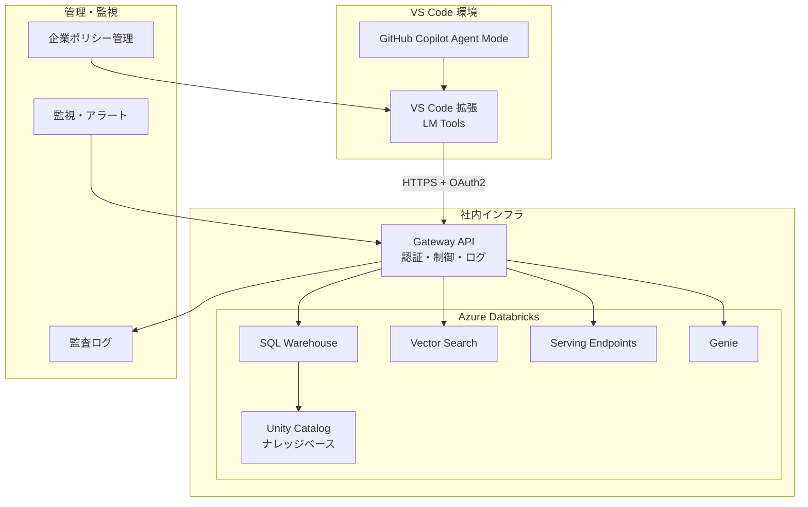
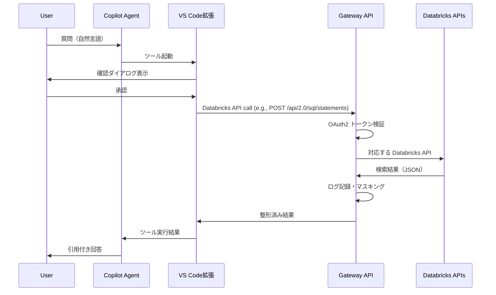
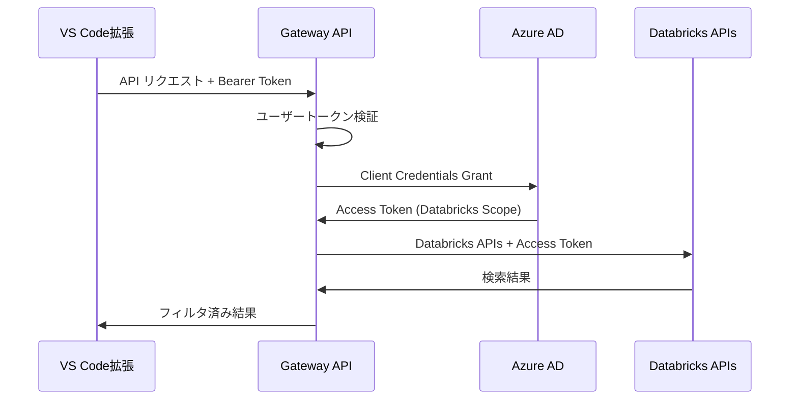

# VS Code Language Model Tool API を活用した Azure Databricks ナレッジベース連携システム 設計書

<br>

# 文書情報
---
* **文書名**: VS Code LM Tools × Azure Databricks ナレッジベース連携システム 設計書
* **作成日**: 2025年9月1日
* **更新日**: 2025年9月1日
* **バージョン**: 1.0
* **作成者**: システム開発チーム
* **関連文書**: 要件定義書 v1.0, LanguageModelToolAPIの使用検討

<br>

# 1. システム設計概要
---

## 1.1. 設計方針
- **セキュリティファースト**: 検索専用アクセス、OAuth2認証、監査ログ完備
- **企業ガバナンス重視**: VS Code ポリシー対応、集中管理機能
- **開発効率最適化**: IDE内完結、自動ツール選択、引用付き回答

## 1.2. アーキテクチャパターン
**3層アーキテクチャ + Gateway パターン**
- **プレゼンテーション層**: VS Code 拡張（LM Tools）
- **アプリケーション層**: Gateway API（認証・制御・ログ）
 - **データ層**: Azure Databricks（SQL Warehouse, Vector Search, Serving Endpoints, Genie, Unity Catalog）

<br>

# 2. システムアーキテクチャ
---

## 2.1. 全体構成図



## 2.2. 通信フロー



<br>

# 3. コンポーネント設計
---

## 3.1. VS Code 拡張（LM Tools）

### 3.1.1. 拡張構成
```
databricks-knowledge-search/
├── package.json              # 拡張メタデータ・設定
├── src/
│   ├── extension.ts          # エントリーポイント
│   ├── tools/
│   │   └── dbxSearchTool.ts  # LM Tools 実装
│   ├── services/
│   │   ├── gatewayClient.ts  # Gateway API クライアント
│   │   └── authService.ts    # 認証管理
│   ├── config/
│   │   └── resources.json    # 利用可能なクエリID・インデックス名など
│   └── utils/
│       └── logger.ts         # ログ出力
└── README.md
```

### 3.1.2. 拡張メタデータ設定

**基本情報**
- 拡張名: `databricks-knowledge-search`
- 表示名: "Databricks Knowledge Search"
- 説明: "Azure Databricks ナレッジベース検索ツール"
- バージョン: 1.0.0
- 対応VS Codeバージョン: 1.99以上

**Language Model Tool 定義**
ToDo: 記載する

**パラメータ仕様**
ToDo: 記載する

**設定項目**
| 設定キー   | デフォルト値                      | 説明                             |
| ---------- | --------------------------------- | -------------------------------- |
| gatewayUrl | https://api.company.com/knowledge | Gateway API のベースURL          |
| timeout    | 10000                             | リクエストタイムアウト（ミリ秒） |

### 3.1.3. LM Tools 実装概要

**DbxSearchTool クラス設計**

Language Model Tool インターフェースを実装し、以下の機能を提供：

**主要機能**
1. **リクエスト受け付け**: パラメータから検索クエリやリソースIDを抽出
2. **ユーザー確認**: 実行前の確認ダイアログ表示
3. **Databricks API 選択**: `resources.json` の定義に基づき利用する API とリソースを決定
4. **Gateway API 呼び出し**: GatewayClient サービスを通じて選択した Databricks API を実行
5. **結果整形**: 検索結果や推論結果を引用可能な形式に整形
6. **エラーハンドリング**: 例外発生時の適切なエラーメッセージ表示

**処理フロー**
1. パラメータ validation
2. ユーザー確認ダイアログ表示
3. リソース定義の読み込み
4. Gateway API クライアント初期化
5. 対応する Databricks API 呼び出し（timeout: 10秒）
6. 結果のMarkdown形式整形
7. Logger による実行ログ記録
8. LanguageModelToolResult として結果返却

**エラー処理戦略**
- Network Error: 接続エラーメッセージ表示
- Timeout Error: タイムアウト通知と再試行提案
- Authentication Error: 認証設定の確認依頼
- API Error: 詳細なエラー情報のログ出力（ユーザーには簡略化メッセージ）

**依存サービス**
- GatewayClient: HTTP通信とレスポンス処理
- Logger: 実行ログとエラーログの記録
- VS Code API: ダイアログ表示とツール結果返却

## 3.2. Gateway API

Python（FastAPI）で実装される Databricks API プロキシサービス。

### 3.2.1. API構成概要

**ディレクトリ構造**

Gateway API は以下のモジュール構成で設計されています：

| モジュール             | 役割                         | 主要ファイル                                                                                                                                            |
| ---------------------- | ---------------------------- | ------------------------------------------------------------------------------------------------------------------------------------------------------- |
| **エントリーポイント** | アプリケーション起動         | app/main.py                                                                                                                                             |
| **ルーティング**       | Databricks API毎のルート定義 | app/routers/sql_statements.py,<br>app/routers/queries.py,<br>app/routers/vector_search.py,<br>app/routers/serving_endpoints.py,<br>app/routers/genie.py |
| **サービス層**         | Databricks API クライアント  | app/services/ (複数ファイル)                                                                                                                            |
| **ミドルウェア**       | 横断的関心事                 | app/middleware/ (3ファイル)                                                                                                                             |
| **ユーティリティ**     | 共通機能                     | app/utils/logger.py                                                                                                                                     |
| **設定**               | 環境別設定                   | config/settings.yaml                                                                                                                                    |

**主要サービス**
1. **statementClient**: Databricks SQL Statement Execution API との通信
2. **queriesClient**: Databricks SQL Queries API との通信
3. **vectorSearchClient**: Vector Search Indexes API との通信（Endpoints API はインデックスをホストする計算リソース管理用）
4. **servingClient**: Real-Time Serving Endpoints API との通信
5. **genieClient**: Genie API との通信
6. **authService**: OAuth2 認証とトークン管理
7. **cacheService**: Redis を使用したレスポンスキャッシュ
8. **auditService**: 監査ログの記録と管理

**ミドルウェア機能**
1. **auth**: JWT トークン検証と認可チェック
2. **rateLimiter**: ユーザー別レート制限の適用
3. **piiMasking**: 個人情報の自動マスキング処理

### 3.2.2. プロキシエンドポイント設計

Gateway API は Databricks API と 1 対 1 のエンドポイントを提供し、リクエストをそのまま転送する。主にサポートするエンドポイントは以下の通り:

| メソッド | パス                                                   | 対応する Databricks API |
| -------- | ------------------------------------------------------ | ----------------------- |
| POST     | /api/2.0/sql/statements                                | SQL Statement Execution |
| POST     | /api/2.0/sql/queries/{query_id}/execute                | SQL Queries             |
| POST     | /api/2.0/vector-search/indexes/{index_name}/query      | Vector Search           |
| POST     | /api/2.0/serving-endpoints/{endpoint_name}/invocations | Real-Time Serving       |
| POST     | /api/2.0/genie/spaces/{space_id}/start-conversation    | Genie                   |

**処理フロー**
1. **リクエスト受信**: LM Tools からのリクエストとパスを検証
2. **認証確認**: Bearerトークンの検証とユーザー情報取得
3. **Databricks呼び出し**: 対応する Databricks API へリクエストを転送
4. **PII マスキング**: 必要に応じてレスポンスの個人情報をマスキング
5. **結果キャッシュ**: 5分間のTTLでRedisに結果保存
7. **監査ログ記録**: 実行ログの記録（ハッシュ化されたクエリ、実行時間等）
8. **レスポンス返却**: 整形済み検索結果の返却

**エラーハンドリング**
- 認証エラー（401）: 無効なトークンまたは期限切れ
- レート制限エラー（429）: ユーザー別制限超過時
- バリデーションエラー（400）: 不正なパラメータ
- 内部エラー（500）: Databricks接続エラーまたはシステム障害

### 3.2.3. Databricks API クライアント設計

Gateway API は Databricks API をそのままプロキシするクライアントを実装する。

**クライアント一覧**
- StatementExecutionClient: `POST /api/2.0/sql/statements` ほか
- QueriesClient: `POST /api/2.0/sql/queries/{query_id}/execute`
- VectorSearchClient: `POST /api/2.0/vector-search/indexes/{index_name}/query`
- ServingClient: `POST /api/2.0/serving-endpoints/{endpoint_name}/invocations`
- GenieClient: `POST /api/2.0/genie/spaces/{space_id}/start-conversation`

#### 3.2.3.1. 共通処理
1. AuthService で OAuth2 トークンを取得する。
2. LM Tools 定義の許可リソースかを検証する。
3. Databricks API と同一のパス・メソッドでリクエストを転送する。
4. Databricks API のレスポンスを変更せずに返却する。

#### 3.2.3.2. StatementExecutionClient
- 対応エンドポイント:
  - `POST /api/2.0/sql/statements`
  - `GET /api/2.0/sql/statements/{statement_id}`
  - `GET /api/2.0/sql/statements/{statement_id}/result/chunks/{chunk_index}`
  - `POST /api/2.0/sql/statements/{statement_id}/cancel`
- ハイブリッドモードや EXTERNAL_LINKS などのパラメーターは LM Tools が指定する。

#### 3.2.3.3. QueriesClient
- 対応エンドポイント: `POST /api/2.0/sql/queries/{query_id}/execute`

#### 3.2.3.4. VectorSearchClient
- 対応エンドポイント: `POST /api/2.0/vector-search/indexes/{index_name}/query`
- `query_text` や `query_vector` の生成は Gateway API では行わない。

#### 3.2.3.5. ServingClient
- 対応エンドポイント: `POST /api/2.0/serving-endpoints/{endpoint_name}/invocations`

#### 3.2.3.6. GenieClient
- 対応エンドポイント: `POST /api/2.0/genie/spaces/{space_id}/start-conversation`

## 3.3.認証サービス設計

### 3.3.1.　OAuth2 実装概要

**認証フロー**

Azure Databricks OAuth2 Client Credentials Grant を使用したサービス間認証を実装します。

**トークン管理戦略**
| 要素                   | 設計内容                                 |
| ---------------------- | ---------------------------------------- |
| **キャッシュ方式**     | メモリベースのトークンキャッシュ         |
| **有効期限管理**       | 期限切れ1分前の自動リフレッシュ          |
| **スコープ**           | 最小権限原則                             |
| **エラーハンドリング** | トークン取得失敗時の指数バックオフ再試行 |

**認証プロセス**
1. **キャッシュ確認**: 有効なアクセストークンがメモリキャッシュに存在するか確認
2. **期限チェック**: トークンの有効期限を確認し、1分前にリフレッシュを実行
3. **トークン取得**: Databricks OIDC エンドポイントに Client Credentials Grant リクエスト
4. **レスポンス処理**: アクセストークンと有効期限の抽出・保存
5. **キャッシュ更新**: メモリキャッシュに新しいトークン情報を保存

**TokenInfo データ構造**
| フィールド  | 型     | 説明                                    |
| ----------- | ------ | --------------------------------------- |
| accessToken | string | OAuth2 アクセストークン                 |
| expiresAt   | number | トークン有効期限（Unix タイムスタンプ） |

**セキュリティ考慮事項**
- クライアント認証情報は環境変数から取得
- トークンはメモリ内でのみ保持（永続化なし）
- HTTPS通信の強制
- 認証失敗時の詳細情報漏洩防止

<br>

# 4. セキュリティ設計
---

## 4.1.　認証・認可アーキテクチャ

### 4.1.1. 多層認証モデル

**認証階層の設計**

システム全体で4層の認証・認可制御を実装：

| 層        | 認証方式                  | 対象           | 検証内容                  |
| --------- | ------------------------- | -------------- | ------------------------- |
| **1層目** | VS Code Account           | エンドユーザー | VS Codeアカウントの有効性 |
| **2層目** | Bearer Token              | Gateway API    | JWTトークンの署名検証     |
| **3層目** | OAuth2 Client Credentials | Databricks API | サービスプリンシパル認証  |
| **4層目** | Unity Catalog RBAC        | ナレッジベース | リソースアクセス権限      |

**認証フロー概要**

1. **ユーザー認証**: VS Code拡張がユーザーのサインイン状態を確認
2. **API認証**: Gateway APIがBearerトークンを検証
3. **サービス認証**: Gateway APIがDatabricksに対してサービス認証を実行
4. **リソース認証**: Databricksが Unity Catalog の権限設定に基づいてアクセス制御

### 4.1.2. OAuth2 フロー詳細


# 5. 配備・デプロイ設計
---

## 5.1. VS Code 拡張配布

### 5.1.1. VSIX パッケージング戦略

**VS Code 拡張の配布方式**

企業環境での安全な拡張配布を実現するためのパッケージング戦略：

**パッケージ作成プロセス**
1. **開発環境での検証**: 機能テストとセキュリティスキャン
2. **VSCE ツール使用**: Visual Studio Code Extension Manager による標準パッケージング
3. **署名付きパッケージ作成**: 企業証明書による電子署名付与
4. **配布用パッケージ準備**: 内部配布用の VSIX ファイル生成

**パッケージング手順**
| ステップ | 作業内容          | 使用ツール          |
| -------- | ----------------- | ------------------- |
| 1        | 依存関係の最新化  | npm update          |
| 2        | テスト実行        | npm test            |
| 3        | VSIX ファイル生成 | vsce package        |
| 4        | デジタル署名付与  | vsce package --sign |

**署名付きパッケージの利点**
- **信頼性確保**: 企業発行の証明書による真正性保証
- **改ざん防止**: パッケージの完全性検証
- **ポリシー準拠**: 企業セキュリティポリシーへの対応

### 5.1.2. 企業内配布戦略

**配布方式とガバナンス**

組織のセキュリティポリシーと管理要件に適合した拡張配布戦略：

**配布方式**
| 方式                     | 対象範囲   | 承認プロセス     | 用途               |
| ------------------------ | ---------- | ---------------- | ------------------ |
| **Internal Marketplace** | 組織全体   | 必須承認         | 全社展開時         |
| **VSIX Direct Install**  | 開発チーム | マネージャー承認 | パイロット・開発用 |

**組織ポリシー設定**
拡張の使用を制御するための VS Code ポリシー設定：

| ポリシーキー                | 設定値                                  | 効果                                |
| --------------------------- | --------------------------------------- | ----------------------------------- |
| extensions.allowed          | ["company.databricks-knowledge-search"] | 許可拡張の明示的指定                |
| chat.agent.enabled          | true                                    | GitHub Copilot Agent モードの有効化 |
| chat.extensionTools.enabled | true                                    | 拡張ツールの LM Tools 使用許可      |

**承認ワークフロー**
1. **開発チーム申請**: 拡張インストール申請の提出
2. **セキュリティレビュー**: 拡張のセキュリティ評価
3. **マネージャー承認**: 業務必要性の確認
4. **IT部門配布**: 承認後の配布実行

**管理機能**
- **使用状況監視**: 拡張の利用状況追跡
- **アップデート管理**: セキュリティアップデートの強制適用
- **利用制限**: 特定ユーザー・グループへのアクセス制御

## 5.2. Gateway API デプロイ

### 5.2.1. コンテナ構成設計

**Docker コンテナ仕様**

Gateway API のコンテナ化による一貫したデプロイメント環境の実現：

**ベースイメージ選定**
- **イメージ**: python:3.11-slim
- **選定理由**: 軽量性、セキュリティ、Python 3.11 サポート

**コンテナ構成要素**
| 要素                         | 設定                                            | 目的                           |
| ---------------------------- | ----------------------------------------------- | ------------------------------ |
| **作業ディレクトリ**         | /app                                            | アプリケーション配置先         |
| **依存関係インストール**     | pip install --no-cache-dir -r requirements.txt  | 本番環境用パッケージのみ       |
| **アプリケーションファイル** | app/, config/                                   | ソースコード・設定ファイル     |
| **実行ユーザー**             | appuser (UID:1001)                              | セキュリティ強化（非root実行） |
| **公開ポート**               | 8000                                            | HTTP API サーバーポート        |
| **起動コマンド**             | uvicorn app.main:app --host 0.0.0.0 --port 8000 | アプリケーション実行           |

**セキュリティ強化策**
1. **非root実行**: 専用ユーザー（appuser）での実行
2. **最小権限**: 必要最小限のファイルアクセス権限
3. **Slim イメージ**: 軽量で脆弱性の少ないベースOS
4. **本番依存関係**: 開発用パッケージの除外

**ビルド最適化**
- **レイヤーキャッシュ**: requirements.txt を先にコピーして依存関係キャッシュを活用
- **不要ファイル除外**: .dockerignore による不要ファイルの除外
- **マルチステージビルド**: 必要に応じてビルドステージの分離