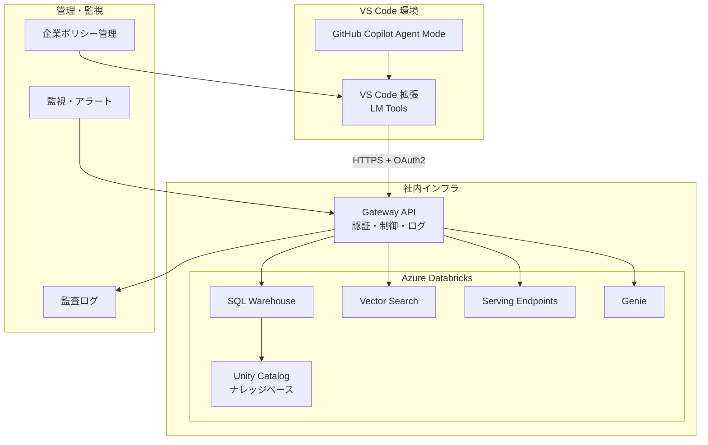
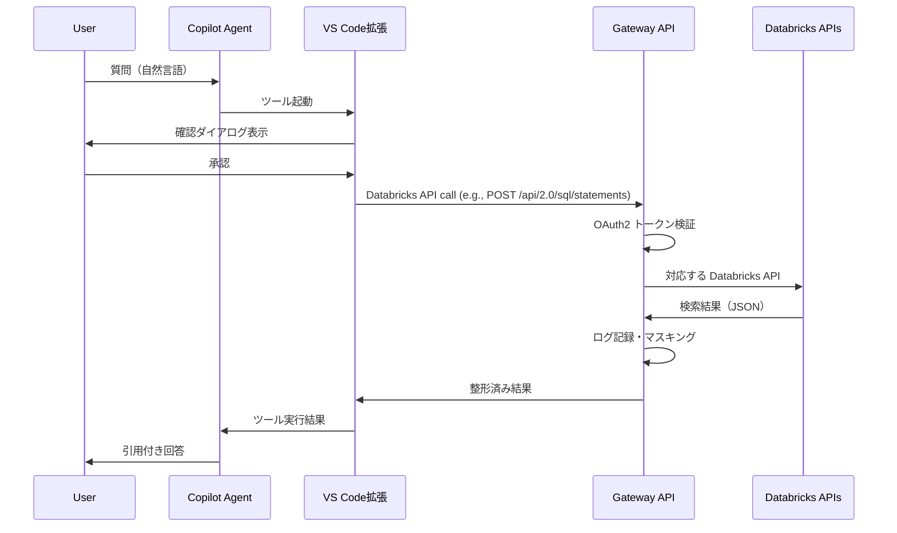
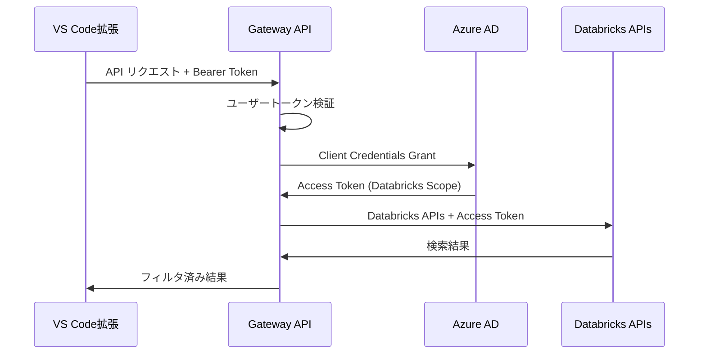

# VS Code Language Model Tool API を活用した Azure Databricks ナレッジベース連携システム 設計書

<br>

# 文書情報
---
* **文書名**: VS Code LM Tools × Azure Databricks ナレッジベース連携システム 設計書
* **作成日**: 2025年9月1日
* **更新日**: 2025年9月1日
* **バージョン**: 1.0
* **作成者**: システム開発チーム
* **関連文書**: 要件定義書 v1.0, LanguageModelToolAPIの使用検討

<br>

# 1. システム設計概要
---

## 1.1. 設計方針
- **セキュリティファースト**: 検索専用アクセス、OAuth2認証、監査ログ完備
- **企業ガバナンス重視**: VS Code ポリシー対応、集中管理機能
- **開発効率最適化**: IDE内完結、自動ツール選択、引用付き回答

## 1.2. アーキテクチャパターン
**3層アーキテクチャ + Gateway パターン**
- **プレゼンテーション層**: VS Code 拡張（LM Tools）
- **アプリケーション層**: Gateway API（認証・制御・ログ）
 - **データ層**: Azure Databricks（SQL Warehouse, Vector Search, Serving Endpoints, Genie, Unity Catalog）

<br>

# 2. システムアーキテクチャ
---

## 2.1. 全体構成図



## 2.2. 通信フロー



<br>

# 3. コンポーネント設計
---

## 3.1. VS Code 拡張（LM Tools）

### 3.1.1. 拡張構成
```
databricks-knowledge-search/
├── package.json              # 拡張メタデータ・設定
├── src/
│   ├── extension.ts          # エントリーポイント
│   ├── tools/
│   │   └── dbxSearchTool.ts  # LM Tools 実装
│   ├── services/
│   │   ├── gatewayClient.ts  # Gateway API クライアント
│   │   └── authService.ts    # 認証管理
│   ├── config/
│   │   └── resources.json    # 利用可能なクエリID・インデックス名など
│   └── utils/
│       └── logger.ts         # ログ出力
└── README.md
```

### 3.1.2. 拡張メタデータ設定

**基本情報**
- 拡張名: `databricks-knowledge-search`
- 表示名: "Databricks Knowledge Search"
- 説明: "Azure Databricks ナレッジベース検索ツール"
- バージョン: 1.0.0
- 対応VS Codeバージョン: 1.99以上

**Language Model Tool 定義**
- `dbxSql` (`databricks-knowledge-search_sql`): Databricks SQL 実行（ハイブリッド / EXTERNAL_LINKS 対応）
- `dbxVectorSearch` (`databricks-knowledge-search_vector`): Vector Search のクエリ/ページング/スキャン/リスト
- `dbxServing` (`databricks-knowledge-search_serving`): Serving invoke / list / get / openapi
- `dbxQueries` (`databricks-knowledge-search_queries`): 保存済みクエリの一覧/取得
- `dbxGenie` (`databricks-knowledge-search_genie`): Genie のスペース/会話/メッセージ操作

**パラメータ仕様（抜粋）**
- `dbxSql`: `{ statement: string, format?: 'markdown'|'json' }`
- `dbxVectorSearch`: `{ operation?: 'query'|'nextPage'|'scan'|'listEndpoints'|'getEndpoint'|'listIndexes'|'getIndex', indexName?: string, query?: string, topK?: number, nextPageToken?: string, endpointName?: string }`
- `dbxServing`: `{ operation?: 'invoke'|'list'|'get'|'openapi', endpoint?: string, payload?: object }`
- `dbxQueries`: `{ operation?: 'list'|'get', id?: string }`
- `dbxGenie`: `{ operation?: 'listSpaces'|'getSpace'|'listConversations'|'startConversation'|'createMessage'|'getMessage'|'executeAttachmentQuery'|'getAttachmentQueryResult', spaceId?: string, conversationId?: string, messageId?: string, attachmentId?: string, title?: string, body?: string, payload?: object }`

**設定項目**
| 設定キー   | デフォルト値                      | 説明                             |
| ---------- | --------------------------------- | -------------------------------- |
| gatewayUrl | https://api.company.com/knowledge | Gateway API のベースURL          |
| timeout    | 10000                             | リクエストタイムアウト（ミリ秒） |

### 3.1.3. LM Tools 実装概要

**DbxSearchTool クラス設計**

Language Model Tool インターフェースを実装し、以下の機能を提供：

**主要機能**
1. **リクエスト受け付け**: パラメータから検索クエリやリソースIDを抽出
2. **ユーザー確認**: 実行前の確認ダイアログ表示
3. **Databricks API 選択**: `resources.json` の定義に基づき利用する API とリソースを決定
4. **Gateway API 呼び出し**: GatewayClient サービスを通じて選択した Databricks API を実行
5. **結果整形**: 検索結果や推論結果を引用可能な形式に整形
6. **エラーハンドリング**: 例外発生時の適切なエラーメッセージ表示

**処理フロー**
1. パラメータ validation
2. ユーザー確認ダイアログ表示
3. リソース定義の読み込み
4. Gateway API クライアント初期化
5. 対応する Databricks API 呼び出し（timeout: 10秒）
6. 結果のMarkdown形式整形
7. Logger による実行ログ記録
8. LanguageModelToolResult として結果返却

**エラー処理戦略**
- Network Error: 接続エラーメッセージ表示
- Timeout Error: タイムアウト通知と再試行提案
- Authentication Error: 認証設定の確認依頼
- API Error: 詳細なエラー情報のログ出力（ユーザーには簡略化メッセージ）

**依存サービス**
- GatewayClient: HTTP通信とレスポンス処理
- Logger: 実行ログとエラーログの記録
- VS Code API: ダイアログ表示とツール結果返却

## 3.2. Gateway API

Python（FastAPI）で実装される Databricks API プロキシサービス。

### 3.2.1. API構成概要

**ディレクトリ構造**

Gateway API は以下のモジュール構成で設計されています：

| モジュール             | 役割                         | 主要ファイル                                                                                                                                            |
| ---------------------- | ---------------------------- | ------------------------------------------------------------------------------------------------------------------------------------------------------- |
| **エントリーポイント** | アプリケーション起動         | app/main.py                                                                                                                                             |
| **ルーティング**       | Databricks API毎のルート定義 | app/routers/sql_statements.py,<br>app/routers/queries.py,<br>app/routers/vector_search.py,<br>app/routers/serving_endpoints.py,<br>app/routers/genie.py |
| **サービス層**         | Databricks API クライアント  | app/services/ (複数ファイル)                                                                                                                            |
| **ミドルウェア**       | 横断的関心事                 | app/middleware/ (2ファイル)                                                                                                                             |
| **ユーティリティ**     | 共通機能                     | app/utils/logger.py                                                                                                                                     |
| **設定**               | 環境別設定                   | config/settings.yaml                                                                                                                                    |

### 3.2.2. 主要サービス

Gateway API では以下の7つのサービスを提供し、Databricks の各 API に対する安全なアクセスを実現します：

#### 3.2.2.1. statementClient - SQL文実行サービス
**機能概要**
- Databricks SQL Statement Execution API (`/api/2.0/sql/statements`) との通信
- アドホック SQL クエリの実行とリアルタイム結果取得

**主要機能**
| 機能           | API エンドポイント                                                       | 説明                               |
| -------------- | ------------------------------------------------------------------------ | ---------------------------------- |
| SQL実行        | `POST /api/2.0/sql/statements`                                           | SQL文の非同期実行を開始            |
| 実行状態取得   | `GET /api/2.0/sql/statements/{statement_id}`                             | 実行状況と結果の第一チャンクを取得 |
| 実行キャンセル | `POST /api/2.0/sql/statements/{statement_id}/cancel`                     | 実行中のSQL文をキャンセル          |
| チャンク取得   | `GET /api/2.0/sql/statements/{statement_id}/result/chunks/{chunk_index}` | 大きな結果セットの分割取得         |

**使用シナリオ**: ナレッジベースからの構造化データ検索、統計情報の集計

#### 3.2.2.2. queriesClient - 保存済みクエリサービス
**機能概要**
- Databricks SQL Queries API (`/api/2.0/sql/queries`) との通信
- 事前に定義された SQL クエリの管理

**主要機能**
| 機能           | API エンドポイント              | 説明                         |
| -------------- | ------------------------------- | ---------------------------- |
| クエリ一覧取得 | `GET /api/2.0/sql/queries`      | 利用可能なクエリ一覧を取得   |
| クエリ詳細取得 | `GET /api/2.0/sql/queries/{id}` | 特定クエリの定義と設定を取得 |

**使用シナリオ**: 定型的な分析レポート、承認済み分析ロジックの取得

#### 3.2.2.3. vectorSearchClient - ベクトル検索サービス
**機能概要**  
- Vector Search API (`/api/2.0/vector-search`) との通信
- ベクトル検索エンドポイントとインデックスの管理、セマンティック検索の実行

**Endpoints管理機能**
| 機能               | API エンドポイント                                     | 説明                                 |
| ------------------ | ------------------------------------------------------ | ------------------------------------ |
| エンドポイント一覧 | `GET /api/2.0/vector-search/endpoints`                 | ベクトル検索エンドポイントの一覧取得 |
| エンドポイント詳細 | `GET /api/2.0/vector-search/endpoints/{endpoint_name}` | 特定エンドポイントの詳細情報と状態   |

**エンドポイント概要**
- **役割**: ベクトル検索インデックスをホストする計算リソースを表現
- **エンドポイントタイプ**: STANDARD（標準タイプ）
- **状態管理**: PROVISIONING（プロビジョニング中）から READY（利用可能）まで
- **インデックス数**: 1つのエンドポイントで複数のインデックスをホスト可能

**Indexes検索機能**
| 機能                 | API エンドポイント                                       | 説明                                       |
| -------------------- | -------------------------------------------------------- | ------------------------------------------ |
| インデックス一覧     | `GET /api/2.0/vector-search/indexes`                     | 利用可能なベクトルインデックス一覧         |
| インデックス詳細     | `GET /api/2.0/vector-search/indexes/{index_name}`        | インデックスの詳細情報と設定               |
| ベクトル検索         | `POST /api/2.0/vector-search/indexes/{index_name}/query` | テキストまたはベクトルでの類似度検索       |
| インデックススキャン | `POST /api/2.0/vector-search/indexes/{index_name}/scan`  | インデックス全体のスキャンとフィルタリング |

**インデックスタイプ**
- **Delta Sync Index**: Delta テーブルと自動同期するインデックス
- **Direct Vector Access Index**: REST API・SDK経由で直接ベクトル読み書きが可能なインデックス

**エンドポイント管理の重要性**
Vector Search では、エンドポイント（計算リソース）とインデックス（データ構造）が分離されており、以下の利点があります：
- **スケーラビリティ**: エンドポイントの計算リソースを独立してスケール
- **運用効率**: 複数のインデックスを1つのエンドポイントで効率的に管理
- **コスト最適化**: 必要に応じた計算リソースの調整

**使用シナリオ**: 文書の意味的類似検索、FAQ 検索、コンテンツ推奨、知識ベース検索

#### 3.2.2.4. servingClient - リアルタイム推論サービス
**機能概要**
- Real-Time Serving Endpoints API (`/api/2.0/serving-endpoints`) との通信  
- MLflow モデルのリアルタイム推論実行

**主要機能**
| 機能               | API エンドポイント                                   | 説明                                         |
| ------------------ | ---------------------------------------------------- | -------------------------------------------- |
| エンドポイント一覧 | `GET /api/2.0/serving-endpoints`                     | 利用可能なモデルサービングエンドポイント一覧 |
| エンドポイント詳細 | `GET /api/2.0/serving-endpoints/{name}`              | エンドポイントの設定と状態情報               |
| スキーマ取得       | `GET /api/2.0/serving-endpoints/{name}/openapi`      | 入出力スキーマ情報                           |
| 推論実行           | `POST /api/2.0/serving-endpoints/{name}/invocations` | モデル推論のリアルタイム実行                 |

**対応モデルタイプ**
- **Unity Catalog モデル**: 登録済み MLflow モデル
- **外部モデル**: OpenAI、Anthropic、Amazon Bedrock など

**使用シナリオ**: 自然言語処理、文書分類、要約生成

#### 3.2.2.5. genieClient - AI/BI自然言語分析サービス
**機能概要**
- Genie API (`/api/2.0/genie/spaces`) との通信
- 自然言語でのデータ分析と洞察生成

**主要機能**
| 機能           | API エンドポイント                                                                           | 説明                          |
| -------------- | -------------------------------------------------------------------------------------------- | ----------------------------- |
| スペース一覧   | `GET /api/2.0/genie/spaces`                                                                  | 利用可能な Genie スペース一覧 |
| スペース詳細   | `GET /api/2.0/genie/spaces/{space_id}`                                                       | スペース設定と権限情報        |
| 会話開始       | `POST /api/2.0/genie/spaces/{space_id}/start-conversation`                                   | 新しい分析会話の開始          |
| メッセージ送信 | `POST /api/2.0/genie/spaces/{space_id}/conversations/{conversation_id}/messages`             | 自然言語での質問送信          |
| 結果取得       | `GET /api/2.0/genie/spaces/{space_id}/conversations/{conversation_id}/messages/{message_id}` | AI分析結果と生成SQLの取得     |

**処理ステータス**
- **FETCHING_METADATA**: データソースメタデータ取得中
- **FILTERING_CONTEXT**: 関連コンテキスト決定中  
- **ASKING_AI**: LLM応答待ち
- **EXECUTING_QUERY**: 生成SQLの実行中
- **COMPLETED**: 分析完了

**使用シナリオ**: ビジネス質問への自動回答、データ探索、傾向分析


### 3.2.3. ミドルウェア機能
1. **auth**: JWT トークン検証と認可チェック
2. **rateLimiter**: ユーザー別レート制限の適用

### 3.2.4. 処理フロー
1. **リクエスト受信**: LM Tools からのリクエストとパスを検証
2. **認証確認**: Bearerトークンの検証とユーザー情報取得
3. **Databricks呼び出し**: 対応する Databricks API へリクエストを転送
4. **PII マスキング**: 必要に応じてレスポンスの個人情報をマスキング
5. **監査ログ記録**: 実行ログの記録（ハッシュ化されたクエリ、実行時間等）
6. **レスポンス返却**: 整形済み検索結果の返却

### 3.2.5. エラーハンドリング
- 認証エラー（401）: 無効なトークンまたは期限切れ
- レート制限エラー（429）: ユーザー別制限超過時
- バリデーションエラー（400）: 不正なパラメータ
- 内部エラー（500）: Databricks接続エラーまたはシステム障害

## 3.3. Gateway APIからDatabricksへの認証方法
1. サービスプリンシパルで、Databricksのアクセストークンを取得し、Key Vaultに登録する。
2. GateWay APIはAzure VMまたは、Azure App Service上で動作させる。
3. Azure VMまたはAzure App ServiceのManaged IDで認証し、Key VaultからDatabricksのアクセストークンを取得し、Databricks APIへのリクエストに使用する。

<br>

# 4. セキュリティ設計
---

## 4.1.　認証・認可アーキテクチャ

### 4.1.1. 多層認証モデル

**認証階層の設計**

システム全体で4層の認証・認可制御を実装：

| 層        | 認証方式           | 対象           | 検証内容                  |
| --------- | ------------------ | -------------- | ------------------------- |
| **1層目** | VS Code Account    | エンドユーザー | VS Codeアカウントの有効性 |
| **2層目** | Bearer Token       | Gateway API    | JWTトークンの署名検証     |
| **3層目** | アクセストークン   | Databricks API | サービスプリンシパル認証  |
| **4層目** | Unity Catalog RBAC | ナレッジベース | リソースアクセス権限      |

**認証フロー概要**

1. **ユーザー認証**: VS Code拡張がユーザーのサインイン状態を確認
2. **API認証**: Gateway APIがBearerトークンを検証
3. **サービス認証**: Gateway APIがDatabricksに対してサービス認証を実行
4. **リソース認証**: Databricksが Unity Catalog の権限設定に基づいてアクセス制御

### 4.1.2. フロー詳細


# 5. 配備・デプロイ設計
---

## 5.1. VS Code 拡張配布

### 5.1.1. VSIX パッケージング戦略

**VS Code 拡張の配布方式**

企業環境での安全な拡張配布を実現するためのパッケージング戦略：

**パッケージ作成プロセス**
1. **開発環境での検証**: 機能テストとセキュリティスキャン
2. **VSCE ツール使用**: Visual Studio Code Extension Manager による標準パッケージング
3. **署名付きパッケージ作成**: 企業証明書による電子署名付与
4. **配布用パッケージ準備**: 内部配布用の VSIX ファイル生成

**パッケージング手順**
| ステップ | 作業内容          | 使用ツール          |
| -------- | ----------------- | ------------------- |
| 1        | 依存関係の最新化  | npm update          |
| 2        | テスト実行        | npm test            |
| 3        | VSIX ファイル生成 | vsce package        |
| 4        | デジタル署名付与  | vsce package --sign |

**署名付きパッケージの利点**
- **信頼性確保**: 企業発行の証明書による真正性保証
- **改ざん防止**: パッケージの完全性検証
- **ポリシー準拠**: 企業セキュリティポリシーへの対応

### 5.1.2. 企業内配布戦略

**配布方式とガバナンス**

組織のセキュリティポリシーと管理要件に適合した拡張配布戦略：

**配布方式**
| 方式                     | 対象範囲   | 承認プロセス     | 用途               |
| ------------------------ | ---------- | ---------------- | ------------------ |
| **Internal Marketplace** | 組織全体   | 必須承認         | 全社展開時         |
| **VSIX Direct Install**  | 開発チーム | マネージャー承認 | パイロット・開発用 |

**組織ポリシー設定**
拡張の使用を制御するための VS Code ポリシー設定：

| ポリシーキー                | 設定値                                  | 効果                                |
| --------------------------- | --------------------------------------- | ----------------------------------- |
| extensions.allowed          | ["company.databricks-knowledge-search"] | 許可拡張の明示的指定                |
| chat.agent.enabled          | true                                    | GitHub Copilot Agent モードの有効化 |
| chat.extensionTools.enabled | true                                    | 拡張ツールの LM Tools 使用許可      |

**承認ワークフロー**
1. **開発チーム申請**: 拡張インストール申請の提出
2. **セキュリティレビュー**: 拡張のセキュリティ評価
3. **マネージャー承認**: 業務必要性の確認
4. **IT部門配布**: 承認後の配布実行

**管理機能**
- **使用状況監視**: 拡張の利用状況追跡
- **アップデート管理**: セキュリティアップデートの強制適用
- **利用制限**: 特定ユーザー・グループへのアクセス制御

## 5.2. Gateway API デプロイ

### 5.2.1. コンテナ構成設計

**Docker コンテナ仕様**

Gateway API のコンテナ化による一貫したデプロイメント環境の実現：

**ベースイメージ選定**
- **イメージ**: python:3.11-slim
- **選定理由**: 軽量性、セキュリティ、Python 3.11 サポート

**コンテナ構成要素**
| 要素                         | 設定                                            | 目的                           |
| ---------------------------- | ----------------------------------------------- | ------------------------------ |
| **作業ディレクトリ**         | /app                                            | アプリケーション配置先         |
| **依存関係インストール**     | pip install --no-cache-dir -r requirements.txt  | 本番環境用パッケージのみ       |
| **アプリケーションファイル** | app/, config/                                   | ソースコード・設定ファイル     |
| **実行ユーザー**             | appuser (UID:1001)                              | セキュリティ強化（非root実行） |
| **公開ポート**               | 8000                                            | HTTP API サーバーポート        |
| **起動コマンド**             | uvicorn app.main:app --host 0.0.0.0 --port 8000 | アプリケーション実行           |

**セキュリティ強化策**
1. **非root実行**: 専用ユーザー（appuser）での実行
2. **最小権限**: 必要最小限のファイルアクセス権限
3. **Slim イメージ**: 軽量で脆弱性の少ないベースOS
4. **本番依存関係**: 開発用パッケージの除外

**ビルド最適化**
- **レイヤーキャッシュ**: requirements.txt を先にコピーして依存関係キャッシュを活用
- **不要ファイル除外**: .dockerignore による不要ファイルの除外
- **マルチステージビルド**: 必要に応じてビルドステージの分離
